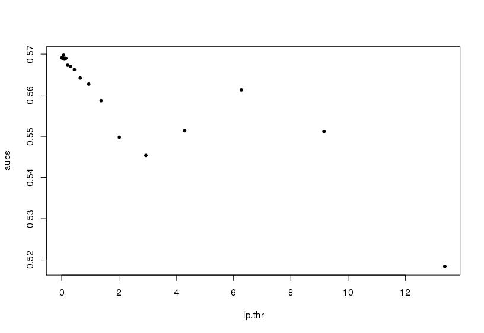
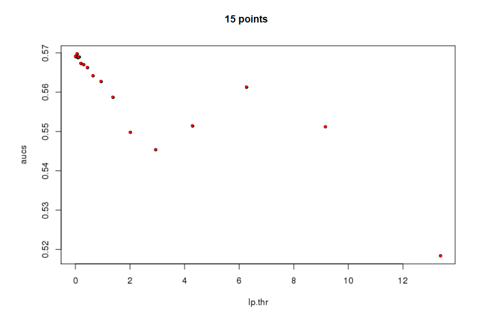

[](https://travis-ci.org/privefl/img2coord)
[](https://ci.appveyor.com/project/privefl/img2coord)
[](https://codecov.io/github/privefl/img2coord?branch=master)

# img2coord

R package to guess coordinates from a scatter plot (as an image).

## Installation and usage

```
devtools::install_github("privefl/img2coord")
library(img2coord)
?get_coord
```

## Example

### Input image

<center></center>

### Code

```
get_coord(
  "tmp-png/prs_bc.png",
  x_ticks = seq(0, 12, 2),
  y_ticks = 52:57 / 100, 
  K_min = 10, 
  K_max = 30
)
```

### Guessed points

```
$x
 [1]  0.01520296  0.06552700  0.12944550  0.20691062  0.30601816  0.44235022
 [7]  0.64579483  0.94394015  1.37816199  2.01197712  2.93945782  4.29281100
[13]  6.27131190  9.15847062 13.37825095

$y
 [1] 0.5690193 0.5697159 0.5688519 0.5672777 0.5669924 0.5662357 0.5641564 0.5626848
 [9] 0.5586805 0.5497790 0.5453504 0.5513921 0.5612438 0.5511934 0.5183720

attr(,"stat")
       10        11        12        13        14        15        16        17 
2.5465144 2.9717697 3.7322112 5.0965441 5.7161786 6.8027607 5.0551897 4.4568252 
       18        19        20        21        22        23        24        25 
3.1147767 2.5863611 2.2906541 1.8843363 1.5162134 1.2102533 1.1990416 1.0414757 
       26        27        28        29        30 
0.9038069 0.7874264 0.7213993 0.6518794 0.6580587 
```

<center></center>
